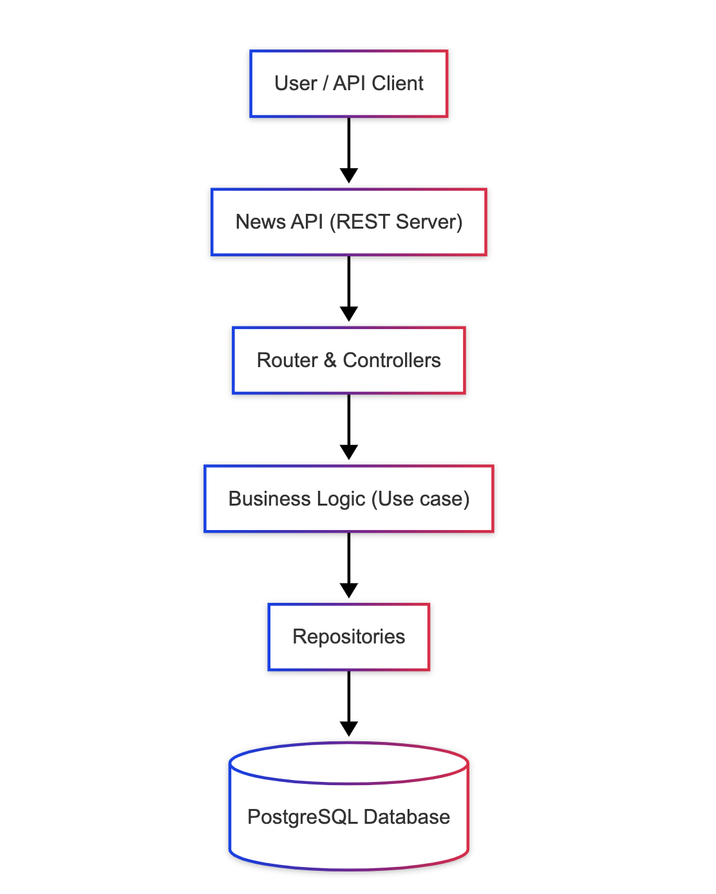
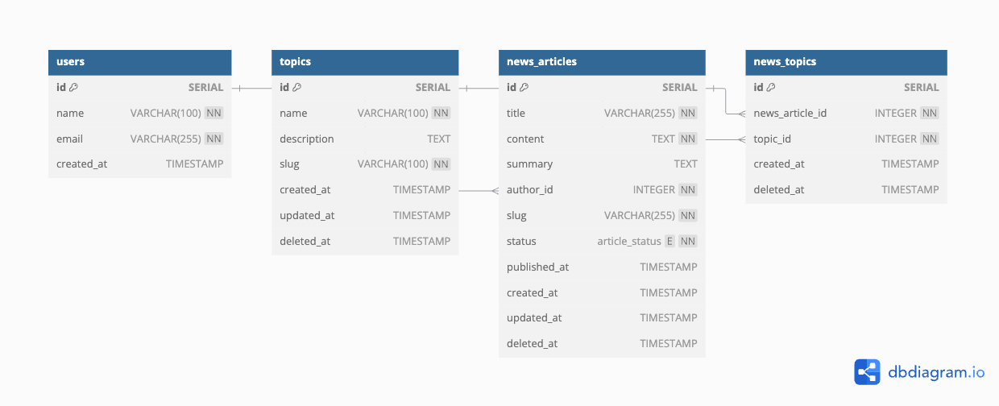
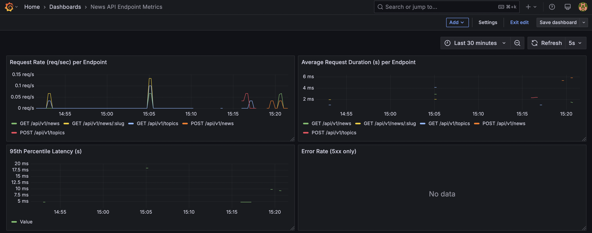

# [News API](https://github.com/derangga/news-api)

A simple CRUD API for managing news articles and topics. The application is built using a clean layered architecture to ensure separation of concerns, making it easy to write unit tests and maintain the codebase.



ref: [Design System](https://www.mermaidchart.com/app/projects/a814a614-e74c-4e79-afa1-5b0c6cba5419/diagrams/b70f13c2-745d-480a-ae52-18b5dfbc4153/version/v0.1/edit)

# 📊 Database schema

The project uses four main tables: `users`, `topics`, `news_articles`, and `news_topics`.

Generated from [dbdiagrams](https://dbdiagram.io/d/news-api-68429013ba2a4ac57b1c0116)


<br><br/>

# 🚀 Getting Started

## Pre-requisite

Make sure the following tools are installed:

- Install Python3
- PostgreSQL
- [Golang migrate](https://github.com/golang-migrate/migrate)
- [Golang mock](https://github.com/golang/mock)

## 🔍 Api Documentation

Before developing new endpoints, please update the API documentation.

1. Go to the `/api-docs` directory and modify `news-api.yaml`.
2. Serve the docs locally using Python `http.server`.

```bash
cd api-docs/
python3 -m http.server 8081
```

3. You can also import the Postman collection found in the `/docs` directory.

## ⚙️ Development Setup

1. Copy the environment template:

```bash
cp env.sample .env
```

2. Start the database (using Docker Compose):

```bash
docker compose up
```

3. Before use `make` command, please uncomment include `.env` inside `Makefile`

4. Apply the database schema:

```bash
make migrate_up
```

5 Run the API server:

```bash
make run_api
```

6. Generate mocks for unit testing:

```bash
make mocks_gen
```

## 🛠️ Build and Serve Project

To build and serve the project:

```
make run
```

## 🖥️ Monitoring

The news app is integrated with prometheus


